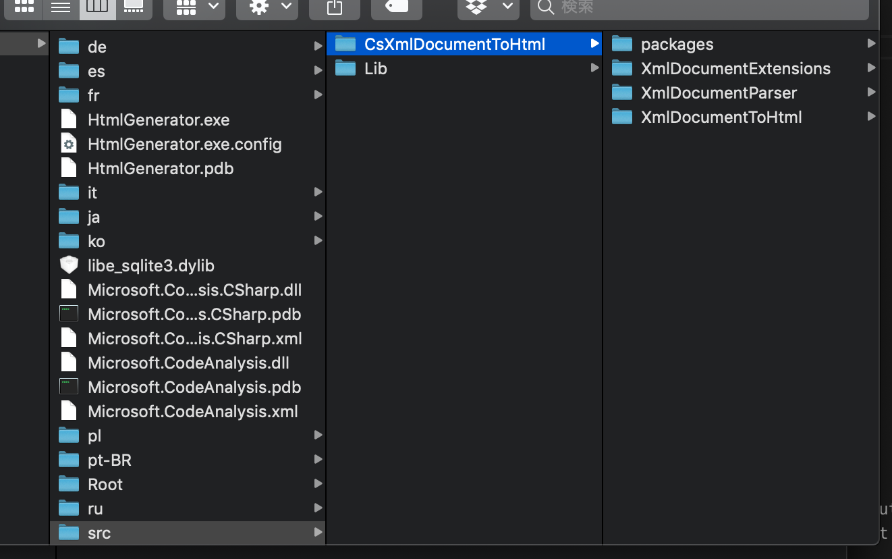
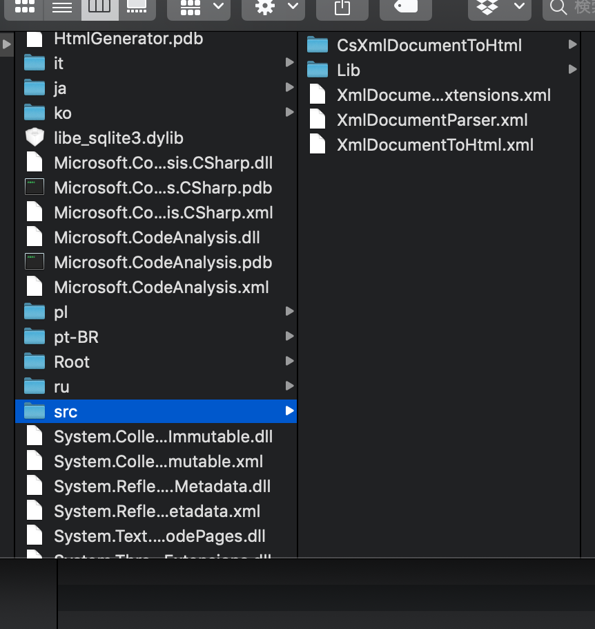

# C# XMLDocument To Html
This program provides a method for converting an XML document that can be output from C# Compiler to a user defined HTML document.  

# Development history and goals
C# XML Document outputs Doc comment written in source code by XML, but it is not suitable for people to read.  
It is ideal that it can be seen using HTML output such as Java and using any Web browser (application installed as a standard application), unfortunately it is not included in C# XML Document. HTML may be implemented by handwriting, but it is inconvenient to do it every time, ideal is to generate HTML with less operation.  
I think inconvenienced when I create my own document.  
So it is the goal of this program and the project to analyze the XML outputted by the C# XML Document, convert it to HTML format, and arrange it so that everyone can read it.  

# Development environment
**Windows**
1. Visual Studio 2019
2. .Net Framework 4.8

**Mac**
1. Visual Studio for Mac
2. Mono for macOS

# Minimum environment required for operation
1. .Net Framework 4.8 (Windows) / Mono for macOS (macOS)

# Note
The .Net Core project will not work properly because system assembly can not be resolved.

# Usage
1. Copy source codes into a suitable directory (Default: src).  
\*The standard directory is src in the execution path.  


2. (Option) XmlDocument exists  
Copy XmlDocuments into source codes directory.  
\*Xml document is automatically generated from the source code so it is unnecessary.


3. Run HtmlGenerator.exe
```sh
HtmlGenerator.exe -b BaseTemplate -o Out -s src
# macOS: mono HtmlGenerator.exe -b BaseTemplate -o Out -s src
```

When using default options, it is as follows.
```sh
HtmlGenerator.exe
# macOS: mono HtmlGenerator.exe
```


**Options**  

| Option | Description | Default |
|-----|:----|:----|
|-b   |Specify the directory where the template file is stored. If you specify this, you can output with your own template.|BaseTemplate|
|-o   |Change the directory path of the output destination.|{Directory of executable file}/Root|
|-s   |csproj file and Source codes directory.|{Directory of executable file}/src|
|-i   |Exclude any project from the analysis. Specify the name of the .csproj file in a space-delimited format.||
|-h   |Show help.||

**Argument**  
Specifies one or more XML Docment outputted by C# XML Document.  


# Sample
[https://aonsztk.xyz/XMLDocumentToHtml/](https://aonsztk.xyz/XMLDocumentToHtml/)  

# Build
1. Open XMLDocumentToHtmlCUI.sln
2. Click the Build button on the menu


# Dependency Libraries
Roslyn: Copyright (c) .NET Foundation and Contributors